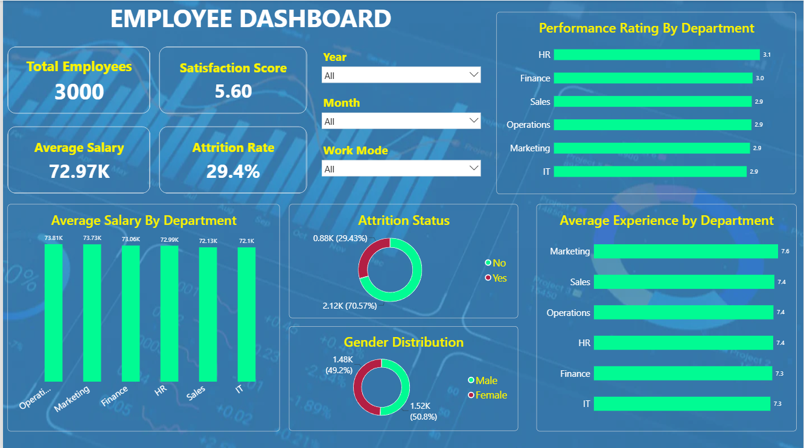

# instadot-internship-snehajaiswani-day8
# HR Employee Performance Dashboard

## Project Overview

This project focuses on analyzing HR employee data using Power BI. The raw dataset contained missing values, duplicate records, inconsistent department names, blank salary values, and other data quality issues. Power Query was used to clean and transform the dataset before creating an interactive dashboard.

## Data Cleaning and Transformation

The following preprocessing steps were performed:

* Removed duplicate employee records.
* Trimmed extra spaces from text columns.
* Standardized department and gender values.
* Replaced missing Salary values using the median salary.
* Replaced missing Satisfaction Score values using the median score.
* Handled invalid and missing records.
* Created appropriate data types for analysis.

## Key Performance Indicators (KPIs)

* Total Employees
* Average Salary
* Employee Satisfaction Score
* Attrition Rate

## Dashboard Visualizations

* Performance Rating by Department
* Average Salary by Department
* Average Experience by Department
* Attrition Analysis
* Gender Distribution

## Tools Used

* Power BI
* Power Query
* DAX
* Microsoft Excel

## Dashboard Screenshot

## Files Included

* HR Dataset (.csv)
* Power BI Dashboard (.pbix)
* Dashboard Screenshot
* PDF Report
* README File
